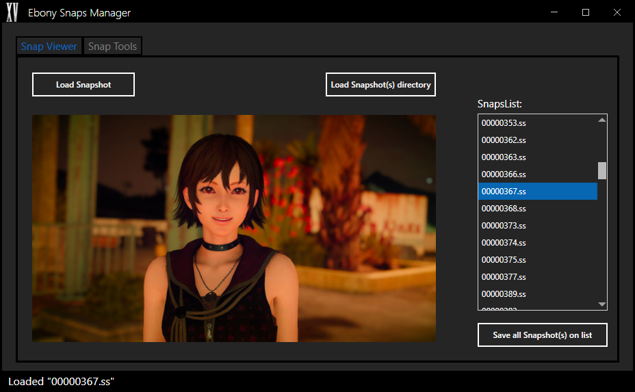

# EbonySnapsManager
This tool allows you to manage the snapshot image files present in FINAL FANTASY XV's photo storage menu. 

Features include the ability to view the snapshot file (.ss), save the image data from the snapshot file, and the ability to add in custom image files as new snapshots into the game's photo storage menu.
 

## Notes:
- The **Add as new snap**, **Add multiple new snaps** and the **Remove blank snaps** options, will modify your save file and the snapshotlink.sl file (present inside the snapshot folder itself). just to be safe, please backup both these files before using any of these options.

- When prompted to select the save file, please select a `gameplay0.save` file present in one of the gameplay\slot folders.

- `slot0` and `slot1` contains the first two autosave files, while the remaining slot folders, contains manually saved files.
  
# Credits
- [yretenai](https://github.com/yretenai) - for helping with the crypto
- [Rinual](https://github.com/Rinual) - for testing the tool
